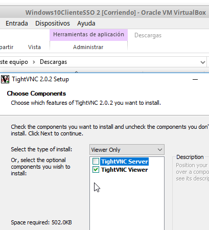

# Informe de Acceso Remoto VNC de Abraham

Instalando Servidor VNC

Instalando Cliente VNC

<h2>Probando en Windows</h2>

Entrando al Servidor desde el Cliente

Contraseña dentro 

Estamos dentro

Comprobamos con netstat

<h2>Probando en OpenSUSE</h2>
Activando el servidor en el OpenSUSE con los comandos.

Comprobando nmap al servidor VNC de OpenSUSE desde maquina kali.

Estamos dentro y comprobando

<h2>Probando de Windows a OpenSUSE</h2>

Entrando al OpenSUSE desde Windows.

<h2>Probando de OpenSUSE a Windows</h2>

Entrando hacia Windows con contraseña por comando vncviewer

Estamos dentro 

<h2>Probando de Windows a OpenSUSE con Display 0 o sea escritorio directo.</h2>

Salio perfecto. Se ve la pantalla en 640 pixeles por el display 0.

